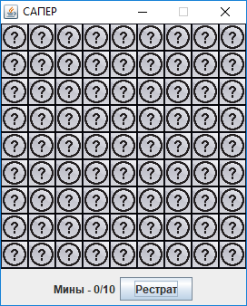
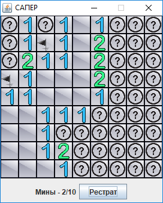
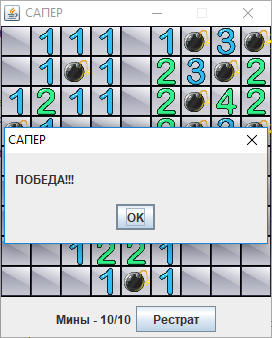
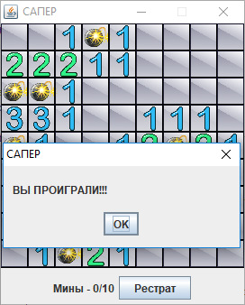

# Windows-Miner

Игровое поле представляет собой квадрат 9x9 клеток, в 10 из которых содержатся мины.
Игроку необходимо отыскать все 10 мин и не активировать их.

Управление: клик ПКМ - установить пометку "мина"; клик ЛКМ - открыть клетку.

Цифры обозначают количество мин в радиусе одной клетки (по вертикали, горизонатели и диагонали) вокруг клетки с фифрой.

<h3>Начало игры:</h3>

<h3>Процесс игры:</h3>

<h3>Победа:</h3>

<h3>Поражение:</h3>

